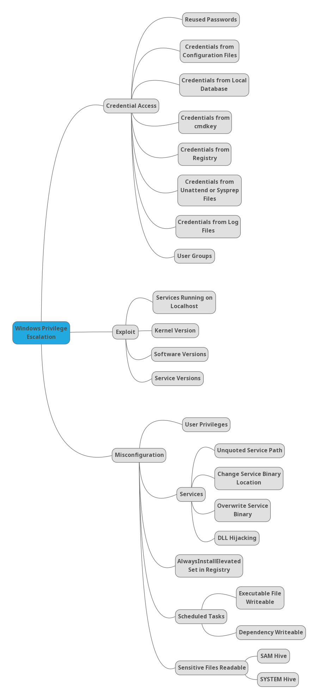

# Privilege Escalation

The adversary is trying to gain higher-level permissions.

## Checklists and Cheatsheets
- Linux
- Windows

## Tools
- Linux
- Windows

## Common Exploits
- Linux
- Windows

## MindMaps
- Linux

- Windows

## References

- https://raw.githubusercontent.com/C0nd4/OSCP-Priv-Esc/
