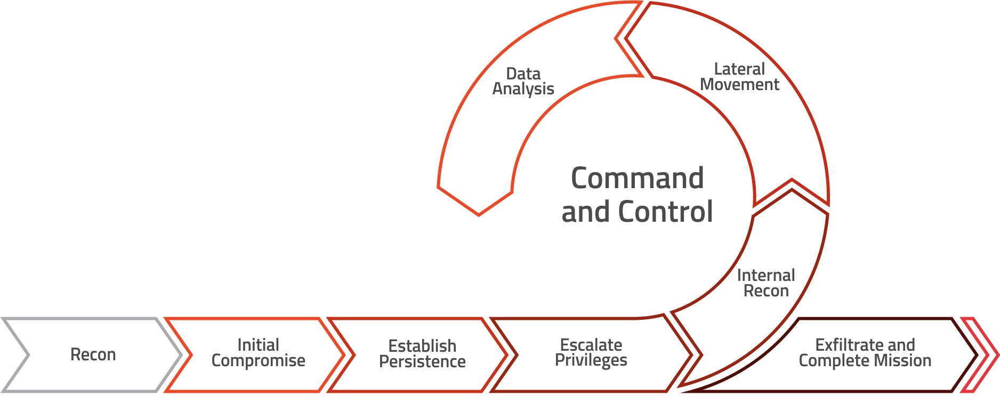

# Red Team

This repo provides a practical guide for offensive security techniques.

The goal is to have a practical structured methodology which red teamers can use during all phases of their engagement.

**What you expect to find**
- Tactics and Techniques
- Tools
- Cheatsheets (all tested or/and previously used)
- References to tools

## Red Team Tactics

- [01-Reconnaissance](01-Reconnaissance/)
- [02-ResourceDevelopment](02-ResourceDevelopment/)
- [03-InitialAccess](03-InitialAccess/)
- [04-Execution](04-Execution/)
- [05-Persistence](05-Persistence/)
- [06-PrivilegeEscalation](06-PrivilegeEscalation/)
- [07-DefenseEvasion](07-DefenseEvasion/)
- [08-CredentialAccess](08-CredentialAccess/)
- [09-Discovery](09-Discovery/)
- [10-LateralMovement](10-LateralMovement/)
- [11-Collection](11-Collection/)
- [12-CommandAndControl](12-CommandAndControl/)
- [13-Exfiltration](13-Exfiltration/)
- [14-Impact](14-Impact/)
- [15-Reporting](15-Reporting/)

---

## Methodology 1

## Methodology 2

## Similar projects
- https://github.com/infosecn1nja/Red-Teaming-Toolkit
- https://github.com/yeyintminthuhtut/Awesome-Red-Teaming
